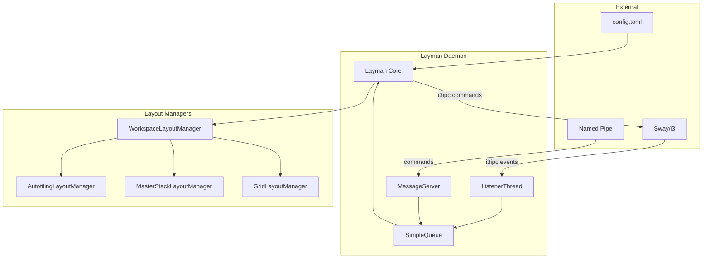

# Contributing to Layman

This guide covers development setup, testing, architecture, and how to contribute.

## Table of Contents

- [Quick Start](#quick-start)
- [Development Setup](#development-setup)
- [Project Structure](#project-structure)
- [Development Workflow](#development-workflow)
- [Testing](#testing)
- [Code Style](#code-style)
- [Adding a Layout Manager](#adding-a-layout-manager)
- [Architecture Overview](#architecture-overview)
- [Tooling Reference](#tooling-reference)

---

## Quick Start

```bash
# Clone and setup
git clone https://github.com/frap129/layman
cd layman
uv sync

# Run layman
uv run layman

# Run all checks
just check
```

## Development Setup

### Prerequisites

- Python 3.10+
- Sway or i3 (for testing)
- [uv](https://github.com/astral-sh/uv) (recommended) or pip
- [just](https://github.com/casey/just) (optional, for task running)

### Install with uv

```bash
curl -LsSf https://astral.sh/uv/install.sh | sh
git clone https://github.com/frap129/layman
cd layman
uv sync
```

### Install with pip

```bash
git clone https://github.com/frap129/layman
cd layman
pip install -e .
```

### Create Dev Config

```bash
mkdir -p ~/.config/layman
cp config.toml ~/.config/layman/
```

Enable debug mode in `~/.config/layman/config.toml`:

```toml
[layman]
debug = true
defaultLayout = "MasterStack"
```

### Run with Debug Output

```bash
uv run layman 2>&1 | tee /tmp/layman.log
```

## Project Structure

```
layman/
├── src/layman/
│   ├── __init__.py
│   ├── __main__.py          # Entry point
│   ├── layman.py            # Main daemon class
│   ├── config.py            # Configuration parsing
│   ├── listener.py          # i3ipc event listener
│   ├── server.py            # Named pipe command server
│   ├── utils.py             # Utility functions
│   └── managers/            # Layout managers
│       ├── __init__.py
│       ├── workspace.py     # Base class
│       ├── autotiling.py    # Autotiling layout
│       ├── master_stack.py  # MasterStack layout
│       └── grid.py          # Grid layout
├── tests/
│   ├── unit/                # Unit tests
│   ├── integration/         # Integration tests
│   └── mocks/               # Mock objects
├── docs/                    # Documentation
├── config.toml              # Example config
├── pyproject.toml           # Python project config
└── justfile                 # Task runner commands
```

## Development Workflow

### Making Changes

```bash
# Create feature branch
git checkout -b feature/my-feature

# Make changes...

# Run linting
just lint

# Test manually
uv run layman

# Run tests
just test

# Commit
git add .
git commit -m "feat: add feature description"

# Push and create PR
git push origin feature/my-feature
```

### Just Commands

```bash
just              # List all commands
just check        # Run format + lint + test
just lint         # Run all linters
just format       # Format code
just test         # Run unit tests
just test-cov     # Run tests with coverage
just run          # Run layman daemon
just run-debug    # Run with debug logging
```

## Testing

### Running Tests

```bash
just test           # All unit tests
just test-fast      # Stop on first failure
just test-verbose   # Verbose output
just test-cov       # With coverage report
just test-cov-html  # Generate HTML coverage
```

### Running Specific Tests

```bash
uv run pytest tests/unit/test_config.py
uv run pytest tests/unit/managers/test_master_stack.py -k "pushWindow"
uv run pytest tests/unit -v -x  # Verbose, stop on failure
```

### Integration Tests

Integration tests require a running Sway or i3:

```bash
just test-integration          # With running Sway/i3
just test-integration-headless # Headless Sway (for CI)
```

### Test Structure

```
tests/
├── conftest.py               # Shared fixtures
├── mocks/
│   └── i3ipc_mocks.py        # Mock i3ipc objects
├── unit/
│   ├── test_config.py
│   ├── test_utils.py
│   └── managers/
│       ├── test_autotiling.py
│       ├── test_grid.py
│       └── test_master_stack.py
└── integration/
    └── test_event_handling.py
```

### Writing Tests

Follow naming convention: `test_<method>_<scenario>_<expectedOutcome>`

```python
def test_pushWindow_firstWindow_addedToList(mock_connection, config):
    # Arrange
    manager = MasterStackLayoutManager(...)
    window = MockCon(id=100)
    
    # Act
    manager.pushWindow(workspace, window)
    
    # Assert
    assert window.id in manager.windowIds
```

## Code Style

### Python

- PEP 8 compliant (enforced by ruff)
- Type hints encouraged
- Line length: 88 characters
- Use descriptive variable names

### Commit Messages

Follow [Conventional Commits](https://www.conventionalcommits.org/):

```
feat: add three-column layout
fix: correct window tracking on close
docs: update MasterStack documentation
refactor: simplify event handling
test: add pushWindow tests
```

### Documentation

- Update docs for API changes
- Use mermaid diagrams for complex flows
- Keep README.md in sync with features

## Adding a Layout Manager

1. Create `src/layman/managers/my_layout.py`:

```python
from layman.managers.workspace import WorkspaceLayoutManager

class MyLayoutManager(WorkspaceLayoutManager):
    shortName = "MyLayout"
    overridesMoveBinds = True
    overridesFocusBinds = False

    def __init__(self, con, workspace, workspaceName, options):
        super().__init__(con, workspace, workspaceName, options)
        # Initialize your state

    def windowAdded(self, event, workspace, window):
        # Handle new window
        pass

    def windowRemoved(self, event, workspace, window):
        # Handle window removal
        pass

    def onCommand(self, command, args):
        # Handle custom commands
        return super().onCommand(command, args)
```

2. Register in `src/layman/managers/__init__.py`:

```python
from layman.managers.my_layout import MyLayoutManager

builtinManagers["MyLayout"] = MyLayoutManager
```

3. Add documentation in `docs/layouts/my-layout.md`

4. Add tests in `tests/unit/managers/test_my_layout.py`

## Architecture Overview



### Key Components

| Component | File | Purpose |
|-----------|------|---------|
| Layman | `layman.py` | Main daemon, event routing, workspace state |
| ListenerThread | `listener.py` | Subscribes to i3ipc events |
| MessageServer | `server.py` | Reads commands from named pipe |
| LaymanConfig | `config.py` | Parses TOML, handles fallbacks |
| WorkspaceLayoutManager | `managers/workspace.py` | Base class for layouts |

### Event Flow

1. Sway emits window event
2. ListenerThread receives via i3ipc
3. Event queued to SimpleQueue
4. Layman processes event on main thread
5. Appropriate layout manager method called
6. Layout manager issues i3ipc commands

## Tooling Reference

### Package Management (uv)

```bash
uv sync              # Install dependencies
uv add package       # Add dependency
uv run command       # Run in venv
```

### Linting (ruff)

```bash
uv run ruff check .           # Check issues
uv run ruff check --fix .     # Auto-fix
uv run ruff format .          # Format code
```

### Type Checking (ty)

```bash
uv run ty check src/
```

### Debug i3ipc

```bash
# Subscribe to events
swaymsg -t subscribe '["window", "workspace", "binding"]' -m

# Query tree
swaymsg -t get_tree | jq .

# Send command
swaymsg '[con_id=12345] focus'
```

## Pull Request Checklist

- [ ] Code follows project style (`just lint` passes)
- [ ] Tests added for new functionality
- [ ] Documentation updated if needed
- [ ] Commit messages follow convention
- [ ] Changes tested manually in Sway/i3
- [ ] No unrelated changes included

## Questions?

Open an issue for discussion before starting major changes.
