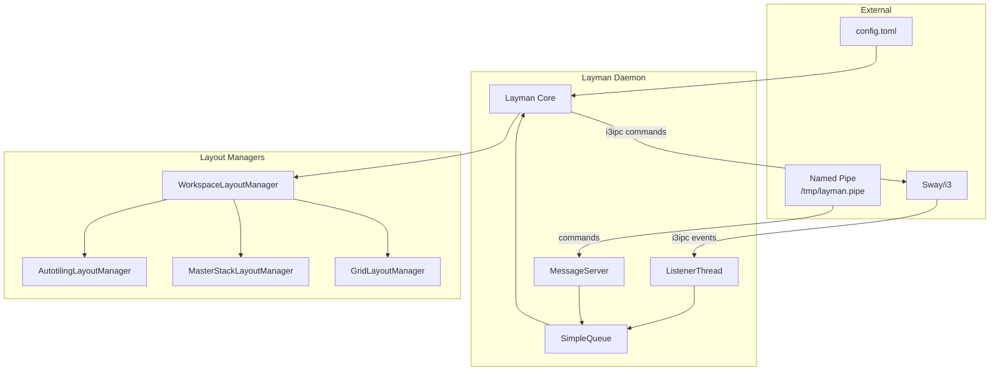

# Layman Documentation

Layman is a daemon that handles layout management for sway/i3 on a per-workspace basis. Each `WorkspaceLayoutManager` (WLM) is responsible for managing all tiling windows on a given workspace.

## Documentation Structure

This documentation is organized into the following sections:

| Directory | Description |
|-----------|-------------|
| [api/](api/README.md) | API reference for core modules and classes |
| [architecture/](architecture/README.md) | System design, components, and data flow |
| [configuration/](configuration/README.md) | Configuration options and examples |
| [development/](development/README.md) | Development setup, testing, and contributing |
| [layouts/](layouts/README.md) | Documentation for each layout manager |
| [roadmap/](roadmap/README.md) | Planned features, bugs, and improvements |

## Quick Start

```bash
# Install from source
git clone https://github.com/frap129/layman
cd layman
uv sync
uv run layman

# Or with pip
pip install ~/path/to/layman
```

## Architecture Overview



## Key Features

- **Per-workspace layout management**: Different layouts on different workspaces
- **Built-in layouts**: Autotiling, MasterStack, Grid
- **Custom layouts**: Python-based user-defined layouts
- **Hot reload**: Reload configuration without restarting
- **Command interface**: Control via keybindings or CLI

## Project Information

- **License**: GPL v3
- **Original Author**: Joe Maples (frap129)
- **Language**: Python 3
- **Dependencies**: i3ipc, setproctitle, tomli
