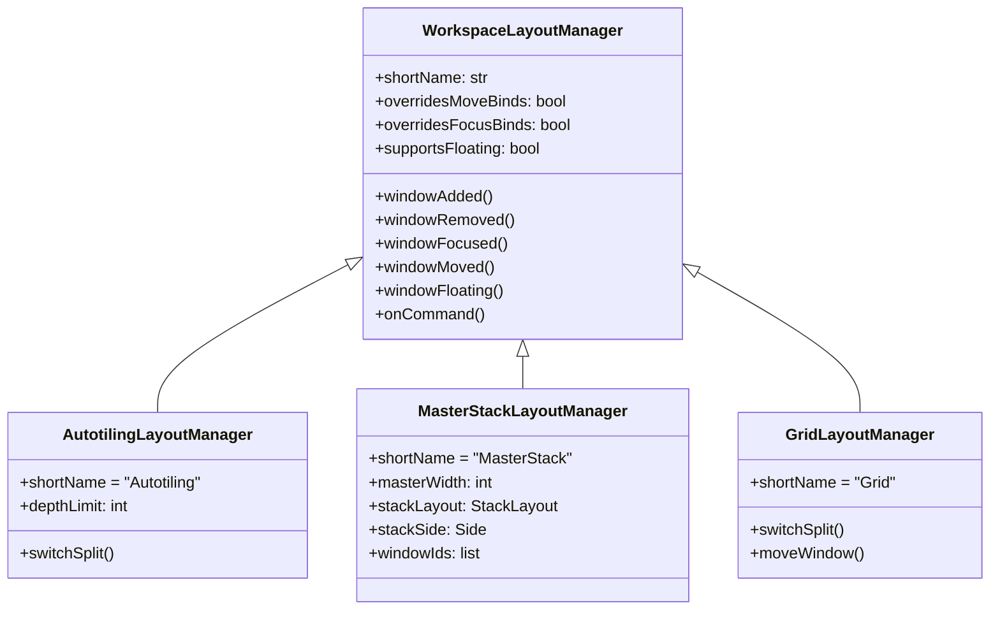

# API Reference

This section documents the public API of layman's core modules and classes.

## Modules

| File | Description |
|------|-------------|
| [core.md](core.md) | Main `Layman` class and event handling |
| [layout-manager.md](layout-manager.md) | `WorkspaceLayoutManager` base class |
| [config.md](config.md) | `LaymanConfig` configuration parsing |

## Class Hierarchy



## Key Types

### WorkspaceState

```python
@dataclass
class WorkspaceState:
    layoutManager: Optional[WorkspaceLayoutManager]
    layoutName: str
    windowIds: set[int]
    isExcluded: bool
```

### Event Types (from i3ipc)

- `WindowEvent`: Window creation, focus, close, move, floating
- `WorkspaceEvent`: Workspace initialization
- `BindingEvent`: Key binding triggers
