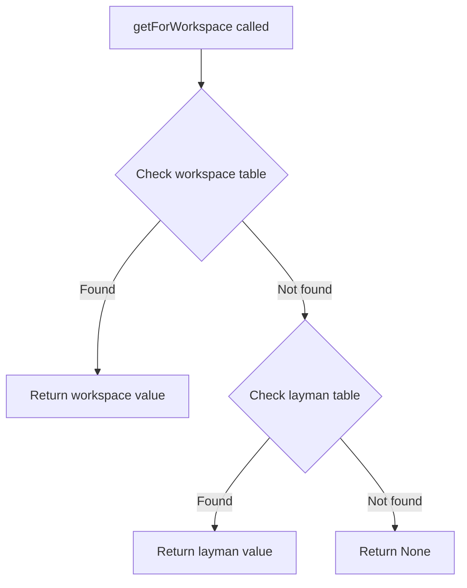

# Configuration API

The `config.py` module handles parsing and accessing configuration options.

## LaymanConfig Class

```python
class LaymanConfig:
    def __init__(self, configPath: Optional[str]):
        self.configDict = self.parse(configPath or CONFIG_PATH)
```

### Methods

#### parse

```python
def parse(self, configPath: str) -> dict
```

Parses a TOML configuration file. Returns empty dict on error.

#### getDefault

```python
def getDefault(self, key: str) -> Any
```

Gets a value from the `[layman]` table.

#### getForWorkspace

```python
def getForWorkspace(self, workspaceName: str, key: str) -> Union[str, int, float, None]
```

Gets a value with workspace-specific override support:

1. First checks `[workspace.<name>]` table
2. Falls back to `[layman]` table
3. Returns `None` if not found

## Configuration Keys

```python
TABLE_LAYMAN = "layman"
TABLE_WORKSPACE = "workspace"
TABLE_OUTPUT = "output"

KEY_DEBUG = "debug"
KEY_EXCLUDED_WORKSPACES = "excludeWorkspaces"
KEY_EXCLUDED_OUTPUTS = "excludeOutputs"
KEY_LAYOUT = "defaultLayout"
```

## Configuration File Format

```toml
[layman]
defaultLayout = "none"
excludeWorkspaces = []
excludeOutputs = []
debug = false
depthLimit = 0
stackLayout = "splitv"
stackSide = "right"
masterWidth = 50

[workspace.1]
defaultLayout = "MasterStack"
masterWidth = 60
stackLayout = "tabbed"

[workspace.2]
defaultLayout = "Autotiling"
depthLimit = 3
```

## Lookup Flow


