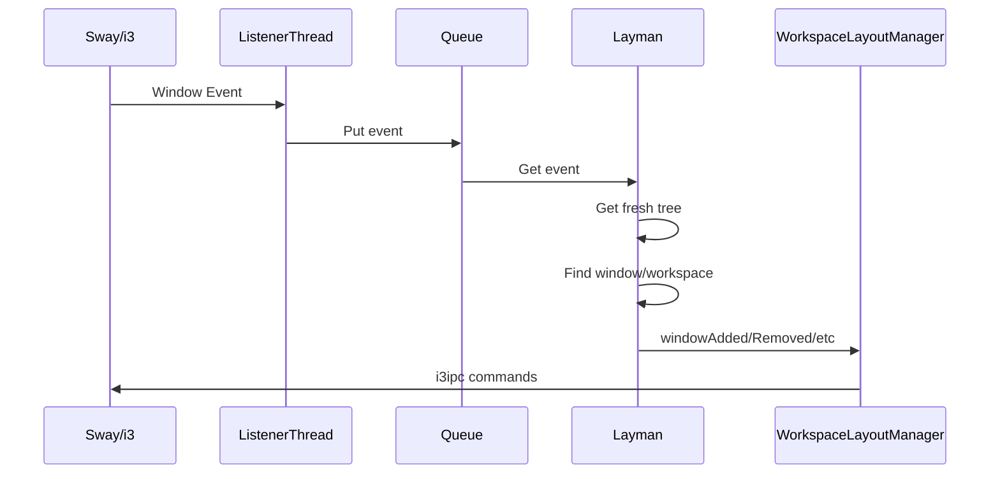

# Core Module API

The core module (`layman.py`) contains the main `Layman` class that orchestrates the layout management daemon.

## Layman Class

The main daemon class that handles:

- Event processing from sway/i3
- Command handling from keybindings and CLI
- Layout manager lifecycle management

### Initialization

```python
class Layman:
    builtinLayouts: dict[str, Type[WorkspaceLayoutManager]]
    userLayouts: dict[str, Type[WorkspaceLayoutManager]]
    workspaceStates: dict[str, WorkspaceState]
```

### Window Event Handlers

#### windowCreated

```python
def windowCreated(
    self,
    event: WindowEvent,
    tree: Con,
    workspace: Optional[Con],
    window: Optional[Con],
)
```

Called when a new window is created. Adds window ID to workspace state and delegates to layout manager.

#### windowFocused

```python
def windowFocused(
    self,
    event: WindowEvent,
    tree: Con,
    workspace: Optional[Con],
    window: Optional[Con],
)
```

Called when a window receives focus. Validates the focus event and delegates to layout manager.

#### windowClosed

```python
def windowClosed(
    self,
    event: WindowEvent,
    tree: Con,
    workspace: Optional[Con],
    window: Optional[Con],
)
```

Called when a window is closed. Finds workspace by window ID tracking, removes from state.

#### windowMoved

```python
def windowMoved(
    self,
    event: WindowEvent,
    tree: Con,
    to_workspace: Optional[Con],
    window: Optional[Con],
)
```

Called when a window moves. Handles both intra-workspace and inter-workspace moves.

#### windowFloating

```python
def windowFloating(
    self,
    event: WindowEvent,
    tree: Con,
    workspace: Optional[Con],
    window: Optional[Con],
)
```

Called when a window's floating state changes. Treats as add/remove unless layout manager supports floating.

### Command Handling

#### handleCommand

```python
def handleCommand(self, command: str)
```

Processes layman commands:

- `layout <name>`: Set workspace layout
- `reload`: Reload configuration
- `move <direction>`: Movement commands
- `focus <direction>`: Focus commands
- Layout-specific commands passed to manager

### Utility Methods

#### command

```python
def command(self, command: str)
```

Executes an i3ipc command and logs results.

#### setWorkspaceLayout

```python
def setWorkspaceLayout(
    self,
    workspace: Optional[Con],
    workspaceName: str,
    layoutName: Optional[str] = None,
)
```

Sets or replaces the layout manager for a workspace.

## Event Flow


