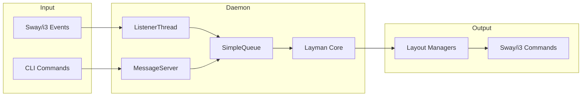

# Architecture

This section documents the system architecture, components, and design patterns used in layman.

## Contents

| File | Description |
|------|-------------|
| [overview.md](overview.md) | High-level architecture overview |
| [components.md](components.md) | Core components and their responsibilities |
| [event-flow.md](event-flow.md) | Event processing and data flow |
| [ipc.md](ipc.md) | IPC mechanisms (i3ipc and named pipe) |

## Architecture at a Glance

Layman uses a multi-threaded architecture with a central event queue:

## Key Design Decisions

1. **Single-threaded event processing**: All events processed serially to avoid race conditions
2. **Fresh tree on each event**: Always fetch current state to avoid stale data
3. **Window ID tracking**: Track windows by ID to handle workspace detection
4. **Layout manager reloading**: Auto-reload on exceptions for resilience
