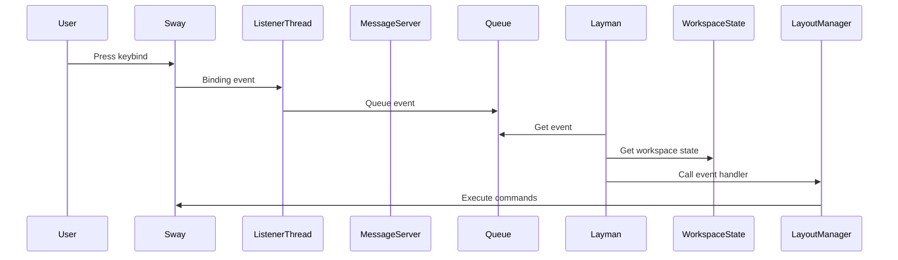

# Components

## Core Components

### Layman

The main daemon class in `layman.py`.

**Responsibilities:**

- Initialize and manage workspace states
- Process events from the queue
- Route commands to layout managers
- Manage layout manager lifecycle

**Key attributes:**

```python
workspaceStates: dict[str, WorkspaceState]
builtinLayouts: dict[str, Type[WorkspaceLayoutManager]]
userLayouts: dict[str, Type[WorkspaceLayoutManager]]
options: LaymanConfig
conn: Connection
```

### WorkspaceState

Tracks per-workspace state.

```python
@dataclass
class WorkspaceState:
    layoutManager: Optional[WorkspaceLayoutManager] = None
    layoutName: str = "none"
    windowIds: set[int] = field(default_factory=set)
    isExcluded: bool = False
```

### ListenerThread

Subscribes to i3ipc events and forwards them to the queue.

```python
class ListenerThread:
    queue: SimpleQueue
    connection: Connection

    events_subscribed = [
        Event.BINDING,
        Event.WINDOW_FOCUS,
        Event.WINDOW_NEW,
        Event.WINDOW_CLOSE,
        Event.WINDOW_MOVE,
        Event.WINDOW_FLOATING,
        Event.WORKSPACE_INIT,
    ]
```

### MessageServer

Reads commands from a named pipe.

```python
class MessageServer:
    PIPE = "/tmp/layman.pipe"

    def readPipe(self):
        while True:
            with open(PIPE) as fifo:
                self.queue.put({"type": "command", "command": fifo.read()})
```

### LaymanConfig

Parses and provides access to configuration.

```python
class LaymanConfig:
    configDict: dict

    def getForWorkspace(self, workspaceName, key) -> Optional[value]
    def getDefault(self, key) -> Optional[value]
```

## Component Interaction



## Layout Managers

All layout managers inherit from `WorkspaceLayoutManager`:

| Manager | Short Name | Description |
|---------|------------|-------------|
| WorkspaceLayoutManager | `none` | Base class, no-op |
| AutotilingLayoutManager | `Autotiling` | Spiral tiling |
| MasterStackLayoutManager | `MasterStack` | Master + stack layout |
| GridLayoutManager | `Grid` | Grid-based tiling |
