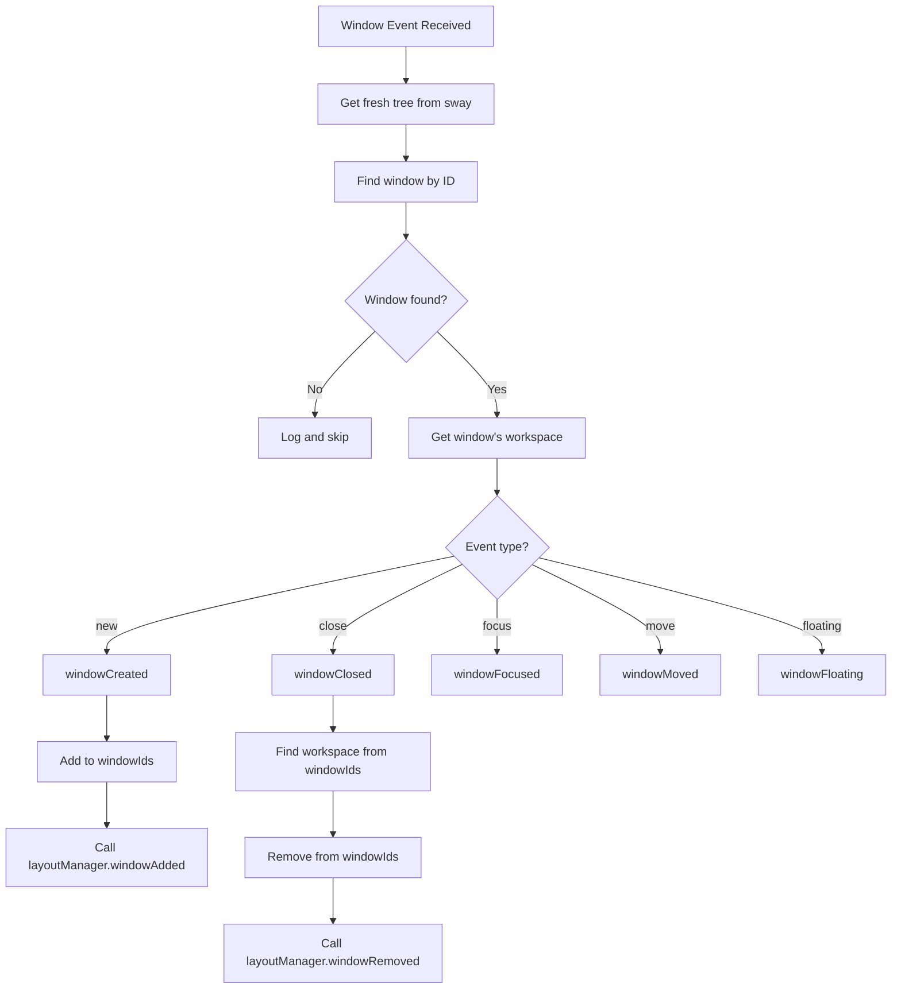
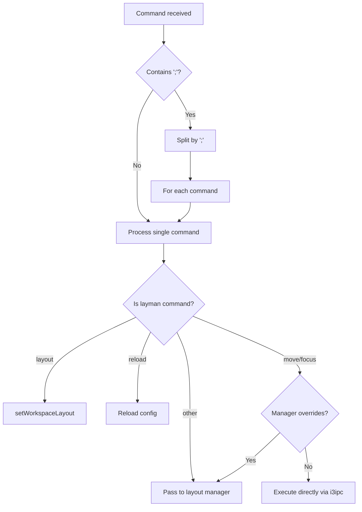

# Event Flow

## Event Sources

Layman receives events from two sources:

1. **i3ipc events**: Window and workspace events from sway/i3
2. **Pipe commands**: Commands from CLI or scripts

## Event Queue

Both sources feed into a `SimpleQueue`:

```python
notification: dict[str, Any] = {
    "type": "event" | "command",
    "event": IpcBaseEvent,  # if type == "event"
    "command": str,         # if type == "command"
}
```

## Main Event Loop

```python
while True:
    notification = notificationQueue.get()  # Blocking

    if notification["type"] == "event":
        # Handle window/workspace/binding events
        ...
    elif notification["type"] == "command":
        # Handle CLI commands
        self.onCommand(notification["command"])
```

## Window Event Processing



## Race Condition Handling

Windows can be created, moved, and closed rapidly. Layman handles this:

1. **Get fresh tree**: Always fetch current state on each event
2. **Skip stale events**: If window/workspace not found, event is ignored
3. **Track by ID**: `windowIds` set tracks which workspace owns which window

## Command Flow



## Binding Event Flow

When a keybind with `nop layman <command>` is pressed:

1. Sway sends `BindingEvent` with the full command
2. Layman extracts the command after "nop layman"
3. Chained commands (`;` separated) are processed sequentially
4. Each command is routed appropriately
