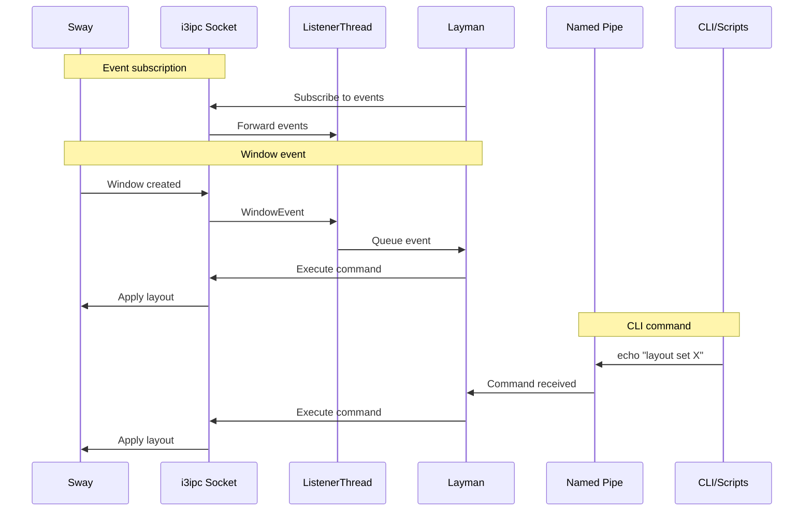

# IPC Mechanisms

Layman uses two IPC mechanisms to communicate with sway/i3 and receive commands.

## i3ipc Connection

### Overview

The `i3ipc` Python library provides:

- Event subscription (window, workspace, binding events)
- Command execution
- Tree querying

### Event Subscription

```python
class ListenerThread:
    def __init__(self, queue: SimpleQueue):
        self.connection = Connection()

        for event in [
            Event.BINDING,
            Event.WINDOW_FOCUS,
            Event.WINDOW_NEW,
            Event.WINDOW_CLOSE,
            Event.WINDOW_MOVE,
            Event.WINDOW_FLOATING,
            Event.WORKSPACE_INIT,
        ]:
            self.connection.on(event, self.handleEvent)
```

### Command Execution

```python
def command(self, command: str):
    results = self.conn.command(command)
    for result in results:
        if result.success:
            self.log("Command succeeded")
        else:
            self.log(f"Command failed: {result.error}")
```

### Tree Queries

```python
# Get full container tree
tree = self.conn.get_tree()

# Find specific window
window = tree.find_by_id(window_id)

# Get all workspaces
workspaces = tree.workspaces()

# Find focused window
focused = tree.find_focused()
```

## Named Pipe (FIFO)

### Overview

A named pipe at `/tmp/layman.pipe` allows external commands:

```bash
echo "layout set MasterStack" > /tmp/layman.pipe
```

### Implementation

```python
class MessageServer:
    PIPE = "/tmp/layman.pipe"

    def __init__(self, queue: SimpleQueue):
        try:
            unlink(PIPE)
        except FileNotFoundError:
            pass

        mkfifo(PIPE)
        thread = Thread(target=self.readPipe, daemon=True)
        thread.start()

    def readPipe(self):
        while True:
            with open(PIPE) as fifo:
                self.queue.put({
                    "type": "command",
                    "command": fifo.read()
                })
```

## Communication Diagram



## Keybinding Integration

### Using `nop` (Recommended)

```
bindsym $mod+m nop layman layout set MasterStack
```

Sway processes this as a no-op but generates a `BindingEvent` that layman receives.

### Using `exec` (Alternative)

```
bindsym $mod+m exec layman layout set MasterStack
```

Starts a new layman process that writes to the pipe. More overhead.

## Command Format

Commands are strings, optionally semicolon-separated:

```
layout MasterStack
move up; focus down
swap master
```

The CLI entry point writes directly to the pipe:

```python
def main():
    if len(sys.argv) > 1:
        command = ' '.join(sys.argv[1:])
        with open(PIPE, "w") as pipe:
            pipe.write(command)
        exit()
```
