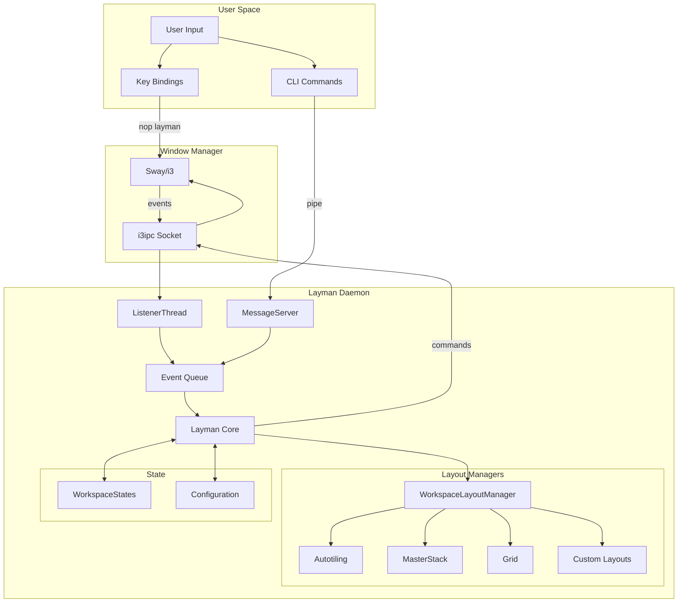
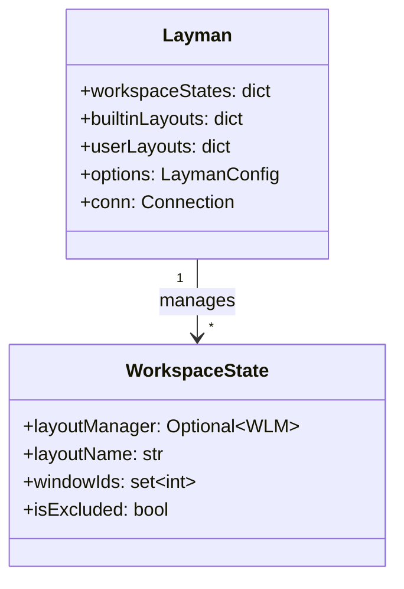

# Architecture Overview

## System Design

Layman is a layout management daemon for sway/i3 that operates as a separate process, communicating with the window manager via IPC.



## Threading Model

Layman uses three threads:

| Thread | Purpose | Blocking |
|--------|---------|----------|
| Main | Event loop processing | Yes (on queue) |
| ListenerThread | i3ipc event subscription | Yes (on events) |
| MessageServer | Named pipe reading | Yes (on pipe) |

All event processing happens on the main thread to ensure thread safety.

## State Management



## Window Tracking

Windows are tracked by ID in `WorkspaceState.windowIds`. This allows:

- Finding the workspace for a closed window (not in tree anymore)
- Detecting inter-workspace moves
- Handling floating windows correctly

## Error Handling

Layout managers are wrapped with `layoutManagerReloader`:

```python
@contextmanager
def layoutManagerReloader(layman, workspace, workspaceName):
    try:
        yield None
    except BaseException as e:
        logging.exception(e)
        layman.setWorkspaceLayout(workspace, workspaceName)
```

On any exception, the layout manager is reinitialized to maintain stability.
