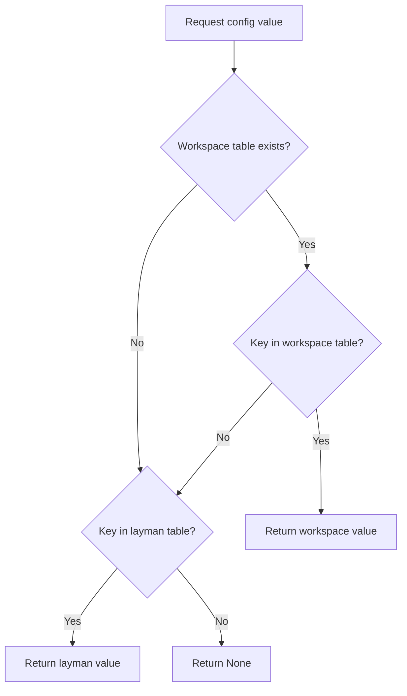

# Configuration

This section documents layman's configuration system.

## Contents

| File | Description |
|------|-------------|
| **[config-reference.md](config-reference.md)** | **Complete configuration reference** — every option explained with examples |
| [options.md](options.md) | Quick-reference option summary table |
| [examples.md](examples.md) | Example configurations for common setups |
| [sway-integration.md](sway-integration.md) | Sway/i3 keybinding integration |
| [window-rules.md](window-rules.md) | Automatic window rules (float, exclude, move) |
| [session-management.md](session-management.md) | Session save/restore |
| [presets.md](presets.md) | Layout presets |

## Configuration File Location

Default: `~/.config/layman/config.toml`

Override with `-c` or `--config`:

```bash
layman -c /path/to/config.toml
```

## TOML Structure

```toml
# Global defaults
[layman]
defaultLayout = "none"
debug = false

# Per-workspace overrides
[workspace.1]
defaultLayout = "MasterStack"

[workspace.coding]
defaultLayout = "Autotiling"
```

## Configuration Precedence



## Hot Reload

Configuration can be reloaded without restarting:

```
layman reload
# or
bindsym $mod+Shift+r nop layman reload
```

**Note:** Reloading affects new layout manager instances. Existing layouts keep their configuration until reset with `layman layout <name>`.
