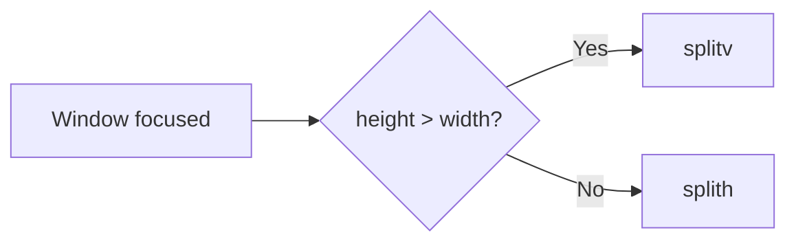

# Autotiling Layout

Based on [nwg-piotr's autotiling](https://github.com/nwg-piotr/autotiling), the Autotiling layout alternates between horizontal and vertical splits based on window dimensions.

## How It Works

When a window is focused, Autotiling checks its dimensions:

- If `height > width`: Use `splitv` (vertical split)
- If `width >= height`: Use `splith` (horizontal split)

This creates a spiral-like pattern as windows are added.



## Visual Example

```
Window 1:                Window 2:
┌─────────────────┐      ┌────────┬────────┐
│                 │      │        │        │
│        1        │  →   │   1    │   2    │
│                 │      │        │        │
└─────────────────┘      └────────┴────────┘

Window 3:                Window 4:
┌────────┬────────┐      ┌────────┬────────┐
│        │        │      │        │   2    │
│   1    │   2    │  →   │   1    ├────────┤
│        ├────────┤      │        │   3    │
│        │   3    │      │        ├────────┤
└────────┴────────┘      │        │   4    │
                         └────────┴────────┘
```

## Configuration

```toml
[layman]
defaultLayout = "Autotiling"
depthLimit = 0  # 0 = no limit

[workspace.1]
defaultLayout = "Autotiling"
depthLimit = 3  # Max 3 levels of nesting
```

### Options

| Option | Type | Default | Description |
|--------|------|---------|-------------|
| `depthLimit` | int | `0` | Maximum nesting depth (0 = unlimited) |

## Depth Limit

The depth limit prevents excessive nesting:

```
depthLimit = 0 (unlimited):        depthLimit = 2:
┌───┬───────────────────┐          ┌───┬───────────────────┐
│   │         2         │          │   │         2         │
│   ├─────────┬─────────┤          │   ├─────────┬─────────┤
│ 1 │    3    │    4    │          │ 1 │    3    │    4    │
│   │         ├────┬────┤          │   │         │         │
│   │         │ 5  │ 6  │          │   │         │  5 (no  │
│   │         │    ├────┤          │   │         │  split) │
│   │         │    │ 7  │          └───┴─────────┴─────────┘
└───┴─────────┴────┴────┘
```

## Commands

```
layman layout Autotiling  # Activate Autotiling on workspace
```

No additional commands - Autotiling is passive.

## Excluded Windows

Autotiling ignores:

- Floating windows
- Fullscreen windows
- Windows in stacked/tabbed containers
- Windows with no workspace

## Implementation

Key method:

```python
def switchSplit(self, window):
    if self.isExcluded(window):
        return

    if self.depthLimit:
        # Check depth before splitting
        ...

    newLayout = "splitv" if window.rect.height > window.rect.width else "splith"
    if newLayout != window.parent.layout:
        self.con.command(newLayout)
```
