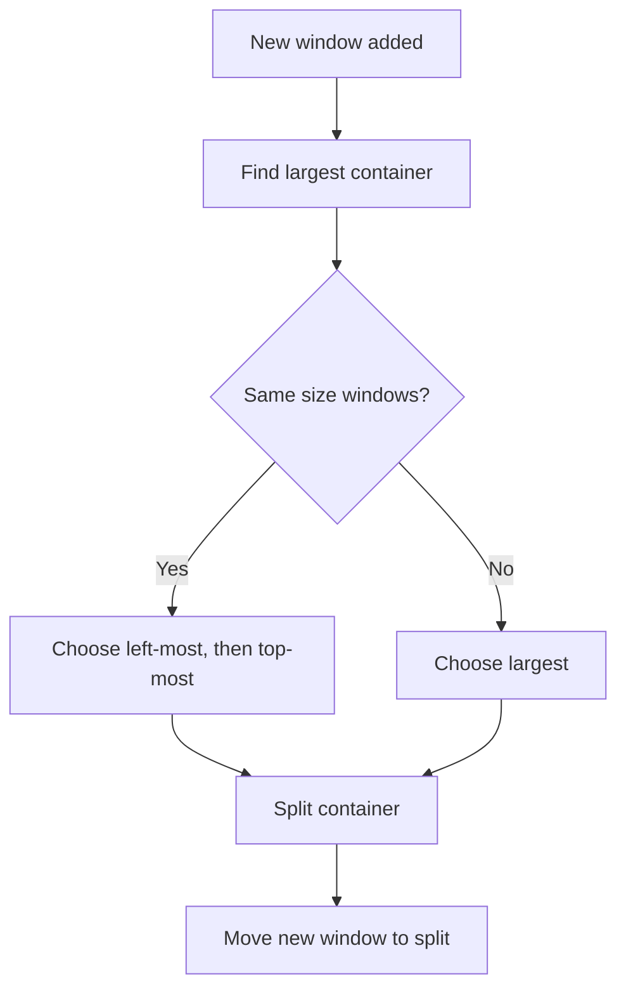

# Grid Layout

The Grid layout distributes windows evenly by always splitting the largest container.

## How It Works

1. When a window is added, find the largest existing window
2. Split that window's container
3. Move new window into the split
4. Result: Approximately equal-sized windows in a grid pattern



## Visual Example

```
1 window:        2 windows:       3 windows:
┌────────────┐   ┌──────┬──────┐  ┌──────┬──────┐
│            │   │      │      │  │      │  2   │
│     1      │ → │  1   │  2   │→ │  1   ├──────┤
│            │   │      │      │  │      │  3   │
└────────────┘   └──────┴──────┘  └──────┴──────┘

4 windows:       5 windows:       6 windows:
┌──────┬──────┐  ┌───┬───┬──────┐ ┌───┬───┬───┐
│  1   │  2   │  │ 1 │ 2 │      │ │ 1 │ 2 │ 3 │
├──────┼──────┤→ ├───┴───┤  3   │→├───┼───┼───┤
│  3   │  4   │  │  4  5 │      │ │ 4 │ 5 │ 6 │
└──────┴──────┘  └───────┴──────┘ └───┴───┴───┘
```

## Configuration

```toml
[layman]
defaultLayout = "Grid"

[workspace.2]
defaultLayout = "Grid"
debug = true
```

### Options

Grid has no layout-specific options. It uses only the global `debug` setting.

## Commands

```
layman layout Grid  # Activate Grid on workspace
```

No additional commands - Grid is passive.

## Tie-Breaking

When multiple windows have the same size:

1. **Left-most first**: Prefer windows with smaller `x` coordinate
2. **Top-most second**: If same `x`, prefer smaller `y` coordinate

This ensures consistent, predictable placement.

## Excluded Windows

Grid ignores:

- Floating windows
- Fullscreen windows
- Windows in stacked/tabbed containers
- Windows with no workspace

## Implementation

Key method:

```python
def windowAdded(self, event, workspace, window):
    if self.isExcluded(window):
        return

    leaves = workspace.leaves()
    largestCon = window.parent
    conSize = window.parent.rect.height + window.parent.rect.width

    for leaf in leaves:
        if leaf.parent.id == window.parent.id:
            continue

        leafSize = leaf.rect.height + leaf.rect.width
        if leafSize > conSize:
            largestCon = leaf
            conSize = leafSize
        elif leafSize == conSize:
            # Tie-breaking: left-most, then top-most
            if leaf.rect.x < largestCon.rect.x or \
               (leaf.rect.x == largestCon.rect.x and leaf.rect.y < largestCon.rect.y):
                largestCon = leaf

    if largestCon.id != window.parent.id:
        self.switchSplit(largestCon)
        self.moveWindow(window.id, largestCon.id)

    self.switchSplit(window)
```

## Use Cases

- **Dashboard layouts**: Equal importance for all windows
- **Monitoring**: Multiple terminal/log windows
- **Image comparison**: Side-by-side viewing
- **Multi-document editing**: When no single "master" document
