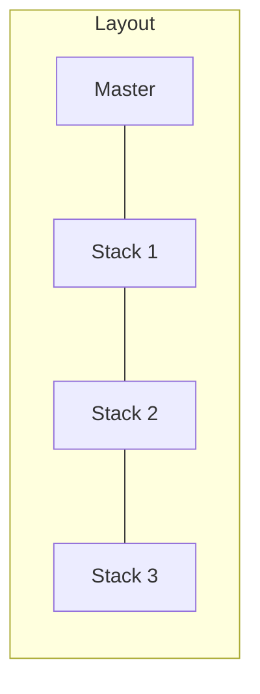

# MasterStack Layout

MasterStack is inspired by dwm/dwl/river, implementing a master window with a configurable stack.

## How It Works

- **Master**: Main window on one side (default: left)
- **Stack**: Remaining windows on the other side
- New windows replace master, pushing old master to top of stack
- Configurable stack layouts: splitv, splith, tabbed, stacking



## Visual Example

```
Default (stackSide = right):     stackSide = left:
┌─────────┬──────────┐           ┌──────────┬─────────┐
│         │  Stack 1 │           │  Stack 1 │         │
│ Master  ├──────────┤           ├──────────┤  Master │
│         │  Stack 2 │           │  Stack 2 │         │
│         ├──────────┤           ├──────────┤         │
│         │  Stack 3 │           │  Stack 3 │         │
└─────────┴──────────┘           └──────────┴─────────┘
```

## Configuration

```toml
[layman]
defaultLayout = "MasterStack"
masterWidth = 50
stackLayout = "splitv"
stackSide = "right"
visibleStackLimit = 3

[workspace.1]
defaultLayout = "MasterStack"
masterWidth = 60           # Master takes 60% width
stackLayout = "tabbed"     # Tabbed stack
stackSide = "left"         # Stack on left
visibleStackLimit = 5      # More visible stack windows
```

### Options

| Option | Type | Default | Values |
|--------|------|---------|--------|
| `masterWidth` | int or float | `50` | 0–100 exclusive (e.g., `50`, `33.3`) |
| `stackLayout` | string | `"splitv"` | `splitv`, `splith`, `tabbed`, `stacking` |
| `stackSide` | string | `"right"` | `left`, `right` |
| `visibleStackLimit` | int | `3` | `0` = disabled, or any positive integer |

## Stack Layouts

### splitv (default)

```
┌─────────┬──────────┐
│         │ Stack 1  │
│ Master  ├──────────┤
│         │ Stack 2  │
│         ├──────────┤
│         │ Stack 3  │
└─────────┴──────────┘
```

### splith

```
┌─────────┬────┬────┬────┐
│         │ S1 │ S2 │ S3 │
│ Master  │    │    │    │
│         │    │    │    │
└─────────┴────┴────┴────┘
```

### tabbed

```
┌─────────┬──────────────┐
│         │[S1][S2][S3]  │
│ Master  │              │
│         │   Stack 1    │
│         │              │
└─────────┴──────────────┘
```

### stacking

```
┌─────────┬──────────────┐
│         │ ┌──────────┐ │
│         │ │ Stack 3  │ │
│ Master  │ │ Stack 2  │ │
│         │ │ Stack 1  │ │
│         │ └──────────┘ │
└─────────┴──────────────┘
```

## Commands

### Layout Control

```
layman layout set MasterStack    # Activate MasterStack
layman stack toggle          # Cycle: splitv → splith → tabbed → stacking
layman stack side toggle      # Toggle: left ↔ right
layman layout maximize              # Toggle maximize mode
```

### Window Movement

```
layman window swap master           # Swap focused with master
layman window move to master        # Move focused to master position
layman window move up               # Move focused up in stack
layman window move down             # Move focused down in stack
layman window move left             # Move towards/away from master
layman window move right            # Move towards/away from master
layman window move to index <n>     # Move to specific position (0 = master)
```

### Window Focus

```
layman window focus master          # Focus master window
layman window focus up              # Focus previous window
layman window focus down            # Focus next window
```

### Rotation

```
layman window rotate cw             # Rotate clockwise
layman window rotate ccw            # Rotate counter-clockwise
```

## Visible Stack Limit (Substack)

When `visibleStackLimit > 0` and using `splitv`, excess stack windows are collapsed into a stacking subcontainer. The default is `3`.

```
visibleStackLimit = 3 (with 6 windows):
┌─────────┬──────────┐
│         │ Stack 1  │  ← Visible
│ Master  ├──────────┤
│         │ Stack 2  │  ← Visible
│         ├──────────┤
│         │ Stack 3  │  ← Visible
│         ├──────────┤
│         │[4][5][6] │  ← Substack (stacking)
└─────────┴──────────┘
```

Set `visibleStackLimit = 0` to disable the substack and show all stack windows individually.

> **Note:** The substack only activates with the `splitv` stack layout. Other layouts (tabbed, stacking, splith) already handle many windows compactly.

## Maximize Mode

Toggle with `layman layout maximize`:

- Turns entire workspace into tabbed layout
- Master becomes first tab
- Stack windows become remaining tabs
- Width preserved for unmaximize

## Key Bindings Example

```
bindsym $mod+m nop layman layout set MasterStack
bindsym $mod+Return nop layman window swap master
bindsym $mod+t nop layman stack toggle
bindsym $mod+y nop layman stack side toggle
bindsym $mod+r nop layman window rotate cw
bindsym $mod+Shift+r nop layman window rotate ccw
bindsym $mod+f nop layman layout maximize
```
